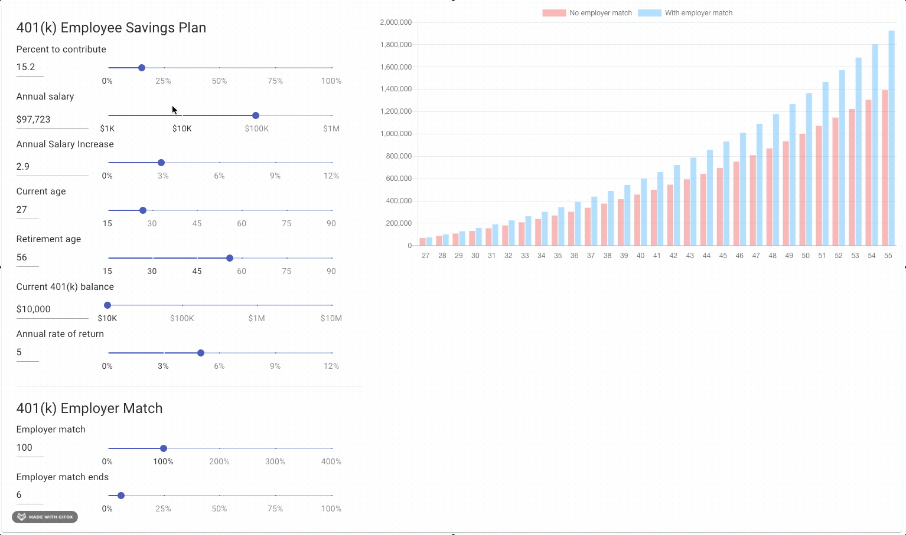

# Material UI 401(k) Calculator

This 401(k) Calculator is designed to help you accurately predict your 401(k) value at retirement. It's a fork of [401k](https://github.com/bsxp/401K).




Install, build and serve

```npm install```

```npm run build```

```npm run start```


## Usage

Adjust each of the paramter sliders to match your current 401K trajectory:

__Employee parameters__
- Percentage of pre-tax annual income to contribute
- Annual pre-tax income
- Expected annual salary increase
- Current age
- Expected age of retirement
- Current 401(k) balance
- Annual rate of return
    - Lower rate of return = lower risk tolerance
    - Higher rate of return = higher risk tolerance

__Employer parameters__
- Employer contribution % match
- Employee salary % match cap

